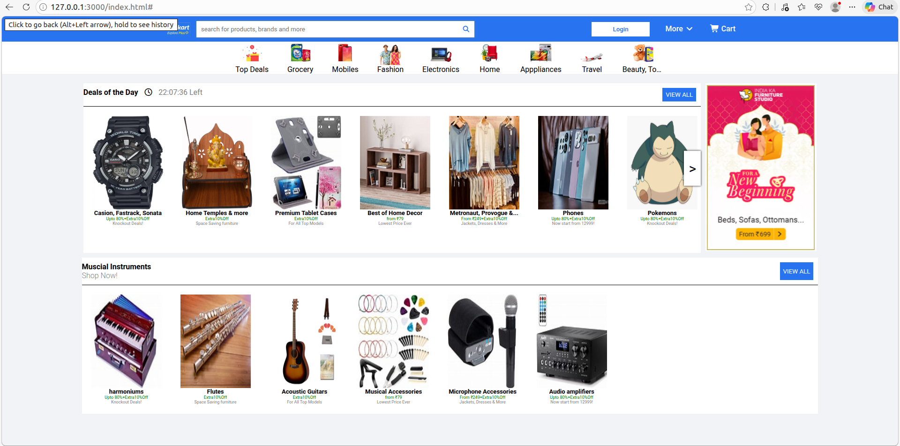
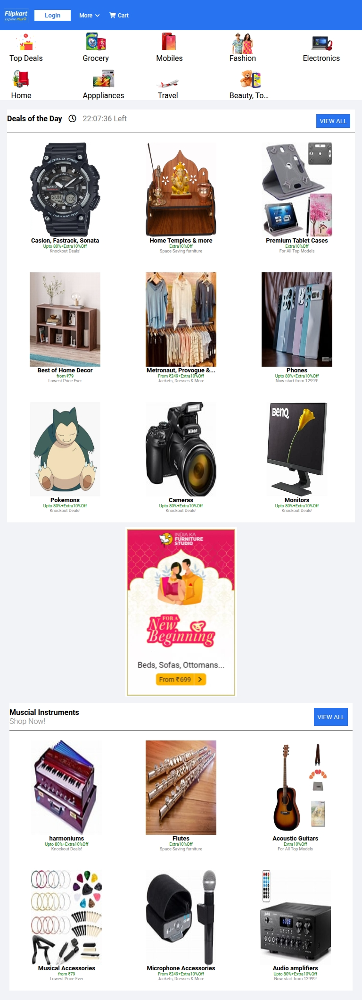
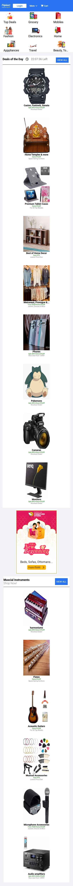

# HTML CSS Practical

## Run This Project Locally

You can replicate and run this project on your local machine in just a few simple steps.  
Assuming you have git/github and a browser.

### Option 1: Clone the Repository (Recommended)

Open your terminal and run:

```bash
git clone https://github.com/Aryan-simform/html-practical.git

cd html-practical
```
---

### Option 2: Download ZIP (Simple)

1.  Go to the repository: [Aryan-simform/html-practical](https://github.com/Aryan-simform/html-practical)
2.  Click the green **Code** button.
3.  Select **Download ZIP**.
4.  Extract the ZIP file.

Now open the project:

Double-click index.html  
OR  
Right-click → Open with browser

---
### Optional: Run Using Live Server 

If you are using VS Code:

Install the Live Server extension

Open the project folder in VS Code

Right-click on index.html

Select Open with Live Server

## Concepts Used

- **Semantic HTML5**  
  Structured layout using `<header>`, `<nav>`, `<section>`, `<figure>`, and other meaningful tags for better readability and accessibility.

- **CSS Reset / Global Styles**  
  Universal selector (`*`) used to remove default margins and paddings and apply a consistent font across the project.

- **Flexbox Layout**  
  Used for:
  - Navigation bar alignment
  - Category row
  - Product showcase rows
  - Item alignment inside cards  
  Key properties: `display: flex`, `justify-content`, `align-items`, `flex-direction`.

- **CSS Grid (Responsive Sections)**  
  Used in smaller screens for category and product layouts.  
  Implemented with:
```css
    grid-template-columns: repeat(auto-fit, minmax(...))
```
- **Responsive Design (Media Queries)**  
  Mobile-friendly layout using:
```css
    @media only screen and (max-width: 768px)
```
  Changes include:
  - Hiding search bar
  - Converting rows to columns
  - Switching from flex to grid layouts
  - Adjusting spacing and font sizes

- **Sticky Navigation Bar**  
  Navigation remains fixed at the top during scroll using:
```css
        position: sticky;
        top: 0;
        z-index: 1000;
```
- **CSS Box Model**  
  Proper use of margin, padding, width, and box-shadow for spacing, alignment, and card styling.

- **External CDN Integration**
  - Font Awesome for icons
  - External product and category images

- **Search Bar UI Implementation**
  - Flexbox-based input and icon alignment
  - Shadow and padding for visual depth

- **Hover Effects**
  Category background changes on hover:
```css
        .category a:hover {
            background-color: #f2f3f6;
        }
```
- **Card-Based Product Layout**
  - Reusable item containers
  - Image, title, discount, and description structure

- **Horizontal Product Showcase**
  - Scroll-style product row using flex containers
  - Scroll button positioned with absolute positioning

- **Absolute and Relative Positioning**
  Scroll button inside product container:
```css
        position: absolute;
        transform: translateY(-50%);
```
## Screenshots:
### Desktop View:

### Tablet View:

### Mobile View:

